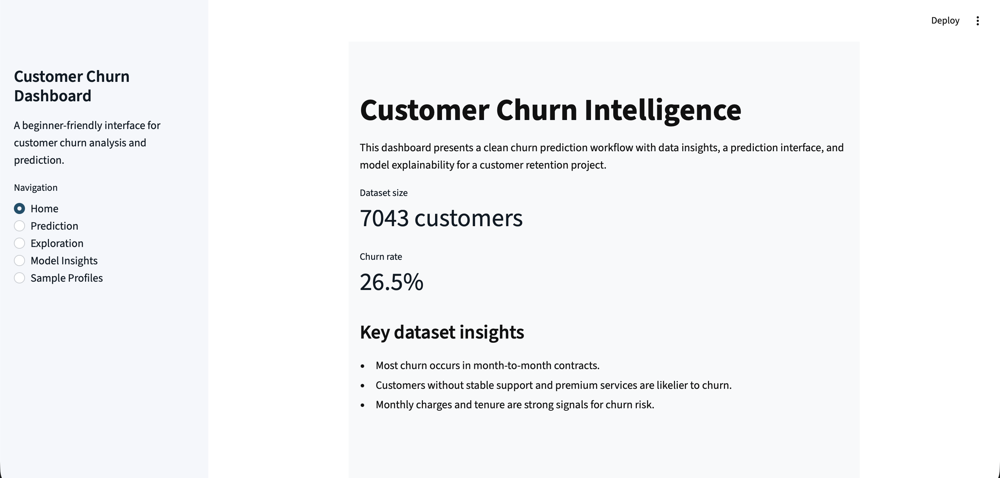
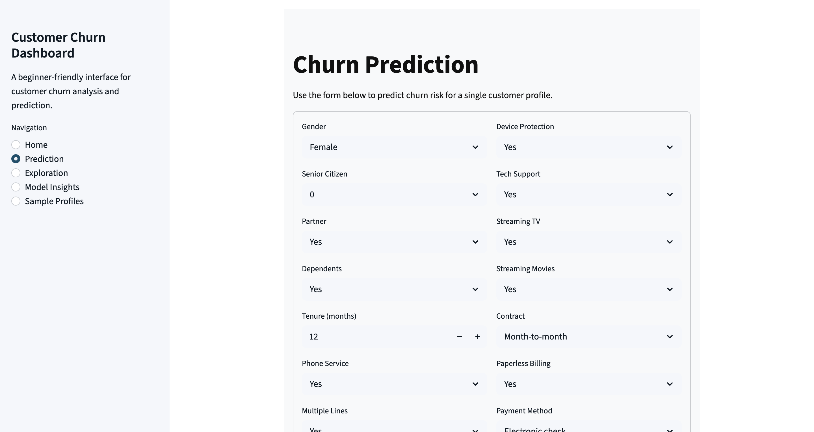
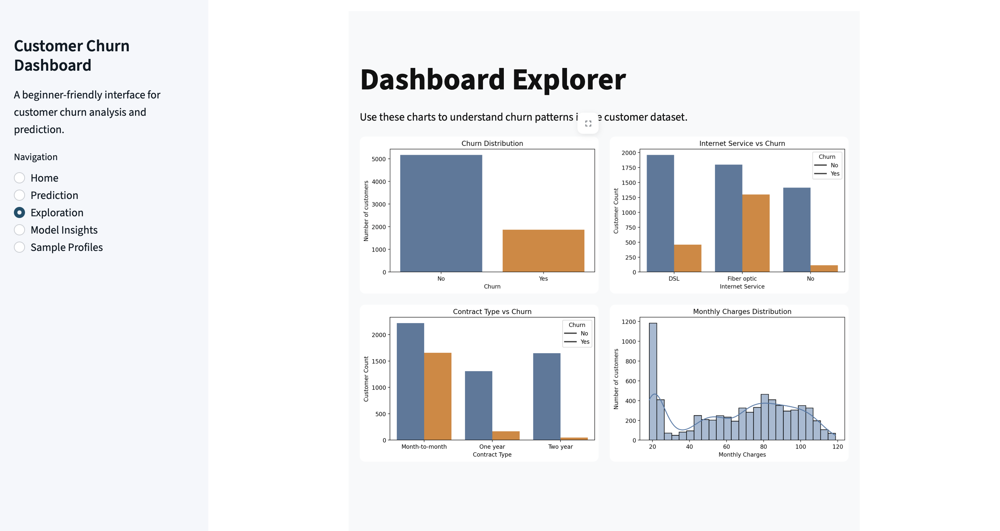

# Customer Churn Intelligence System

A clean and modular churn prediction project built for a portfolio-ready machine learning workflow. The codebase separates preprocessing, model training, prediction, explainability, API serving, and dashboard visualization.

## Project structure

- `src/`
  - `config.py`: file and folder path constants
  - `preprocessing/`: cleaning, feature engineering, encoding, and train/test split helpers
  - `training/`: model creation, evaluation, and tuning utilities
  - `prediction/`: pipeline loading and prediction helpers
  - `explainability/`: SHAP explainability utilities
- `data/raw/`: original dataset source
- `data/processed/`: saved training and test splits
- `model/`: trained pipeline artifact and evaluation report
- `dashboard/`: Streamlit dashboard for churn exploration, prediction, and model insights
- `notebooks/`: EDA and modeling notebooks
- `tests/`: unit tests for core preprocessing and data functions

## Main training script

`main.py` is the project training entrypoint. It:

- loads raw data from `data/raw/dataset.csv`
- applies cleaning and feature engineering
- splits the dataset into training and test sets
- builds a preprocessing + classifier pipeline
- trains the pipeline and evaluates performance
- saves the trained pipeline to `model/customer_churn_pipeline.pkl`
- writes a training report to `model/training_report.txt`

Run the training script with default settings:
```bash
python main.py
```

Or choose a classifier type:
```bash
python main.py --model logistic
python main.py --model random_forest
python main.py --model xgboost
```

## Dashboard

The dashboard provides a beginner-friendly interface for churn analysis and prediction.

| Home | Prediction | Model Insights |
|---|---|---|
|  |  |  |
| Overview metrics and churn summary for the dataset. | Single-record churn prediction form with probability output. | Logistic regression coefficient analysis and model explainability. |

Run it locally from the repository root:
```bash
streamlit run dashboard/app.py
```

Then open the URL shown in the terminal (typically `http://localhost:8501`).

> The dashboard uses a locked light theme via `.streamlit/config.toml` at the project root, ensuring consistent light UI styling regardless of the operating system theme.

### Dashboard screenshots

Store dashboard screenshots in `dashboard/assets/` and reference them using GitHub markdown. Suggested screenshot filenames:

- `dashboard/assets/home-page.png`
- `dashboard/assets/prediction-page.png`
- `dashboard/assets/model-insights-page.png`

## Recommended workflow

1. Install dependencies:
   ```bash
   pip install -r requirements.txt
   ```
2. Train the model and save the pipeline:
   ```bash
   python main.py
   ```
3. Launch the dashboard:
   ```bash
   streamlit run dashboard/app.py
   ```

## Notes

- `main.py` is required to produce the saved model pipeline used by both the API and dashboard.
- The project favors reusable Python modules instead of monolithic notebook code.
- Use the dashboard for interactive exploration and the saved pipeline for deployment or batch prediction.
